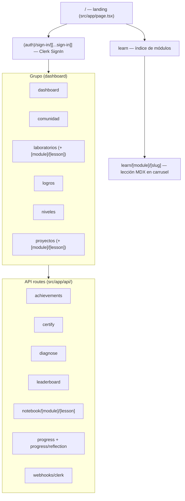
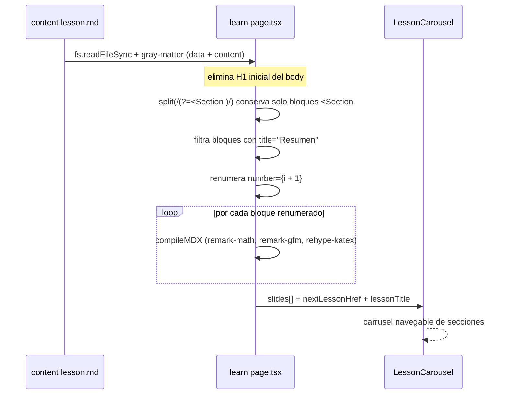
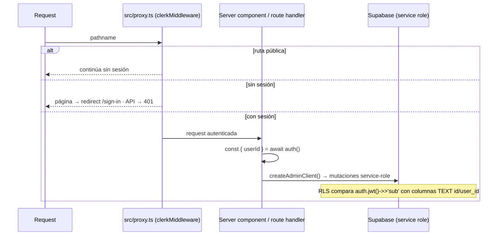
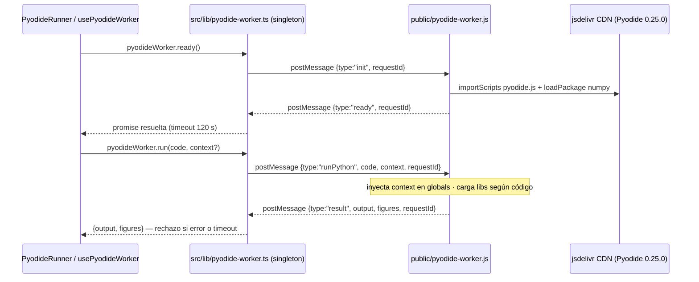

<!--
Generated: 2026-08-24 · Tools: codebase-memory-mcp 0.10.8 · CodeGraph index 2026-08-24 · Next.js 16.2.10
Regeneration guide: openspec/changes/platform-architecture-docs/design.md
-->

# Arquitectura de InVitro-Code

## 0. Alcance de este documento

Este documento es la referencia arquitectónica de la plataforma **InVitro-Code**: una plataforma interactiva de aprendizaje (estilo Duolingo) para que estudiantes de biotecnología aprendan IA/ML resolviendo desafíos de código en el navegador.

Cada afirmación conductual está respaldada por rutas y símbolos concretos del repositorio. Cuando una fuente autoritativa (`AGENTS.md`, especificaciones en `openspec/specs/*`) difiere del código observado, **prevalece el código** y la discrepancia se marca en línea con un bloque `> Nota:`.

## 1. Introducción y alcance

La plataforma es una aplicación **Next.js 16 (App Router)** con contenido educativo definido por el sistema de archivos (MDX), autenticación delegada por completo a **Clerk**, persistencia en **Supabase** (PostgreSQL, sin usar Supabase Auth) y ejecución de Python en el navegador mediante un **Web Worker con Pyodide**. Se despliega en Vercel.

El documento cubre, en orden: stack y capas (§2), mapa de rutas (§3), pipeline de contenido de lecciones (§4), autenticación y datos (§5), ejecución de Python en el navegador (§6), superficie de API (§7), gamificación y tiempo real (§8) y convenciones de mantenimiento (§9).

## 2. Stack y capas

Fuentes: `package.json`, `src/app/`, `src/components/`, `src/lib/`, `src/content/modules/`, `next.config.ts`.

| Capa | Ruta | Responsabilidad |
|------|------|-----------------|
| Rutas (App Router) | `src/app/` | Páginas React Server Components y handlers de API |
| Componentes | `src/components/` | UI reutilizable: lección (`lesson/`), laboratorios (`labs/`), gamificación (`gamification/`), editor (`editor/`) |
| Librería compartida | `src/lib/` | Cliente admin de Supabase (`supabase/admin.ts`), worker de Pyodide (`pyodide-worker.ts`), lógica de gamificación (`gamification/`), utilidades de contenido (`content/`) |
| Hooks | `src/hooks/` | `usePyodideWorker.ts` y otros hooks de cliente |
| Contenido | `src/content/modules/` | Lecciones en MDX organizadas por módulo (fuente de verdad pedagógica) |
| Worker estático | `public/pyodide-worker.js` | Web Worker real de Pyodide (archivo estático servido tal cual) |

Detalles del stack observado:

- **Next.js 16.2.10** con App Router y Turbopack. TypeScript con alias `@/*` → `src/*`.
- **Tailwind CSS v4** para estilos.
- **MDX compilado en servidor** vía `next-mdx-remote/rsc` (`compileMDX` / `MDXRemote`), con plugins `remark-math` + `remark-gfm` y `rehype-katex` para matemáticas LaTeX (`$...$`).
- **Clerk** (`@clerk/nextjs/server`) como único proveedor de autenticación.
- **Supabase JS client** (`@supabase/supabase-js`) para acceso a PostgreSQL.
- Despliegue en **Vercel**; `next.config.ts` permite imágenes solo de `img.clerk.com` y `vercel.com`.

## 3. Mapa de rutas

Fuente: inventario de `page.tsx` y `route.ts` bajo `src/app/`, más las reglas de acceso en `src/proxy.ts`.

Reglas de acceso (`src/proxy.ts`, middleware `clerkMiddleware`):

- Rutas públicas declaradas: `/`, `/sign-in`, `/sign-up`, `/api/webhooks/clerk`, `/api/diagnose`.
- Resto de páginas sin sesión → redirección a `/sign-in` con `redirect_url`.
- Resto de rutas `/api/*` sin sesión → respuesta JSON con estado `401`.
- El matcher excluye internos de Next.js (`_next`) y archivos estáticos, pero siempre corre para `/api/*`, `/trpc/*` y `/__clerk/*`.

Detalle dinámico:

- `(dashboard)/laboratorios/[module]/[lesson]/page.tsx` y `(dashboard)/proyectos/[module]/[lesson]/page.tsx` resuelven contenido por convención de directorios en `src/content/modules/{module}/lessons/{lesson}/`; si el directorio no existe, llaman `notFound()`.
- La página de laboratorio exige `lab.md` (obligatorio) y acepta opcionalmente `quiz.md` y `notebook.ipynb`; compila el MDX con `compileMDX` y, si la compilación falla, muestra el texto crudo como fallback.
- `learn/[module]/[slug]/error.tsx` y `learn/[module]/[slug]/not-found.tsx` manejan errores e lecciones inexistentes.

## 4. Pipeline de contenido de lecciones

Fuentes: `src/app/learn/[module]/[slug]/page.tsx`, `src/lib/content/modules.ts`, `src/content/modules/*/module.json`, `src/components/lesson/index.ts`.

Estructura de contenido (`src/content/modules/{module}/lessons/{lesson}/`):

- `lesson.md` — lección MDX con frontmatter YAML.
- `quiz.md`, `lab.md`, `assignment.md`, `notebook.ipynb`, `references.bib` y opcionalmente `slides.md`.
- `{module}/module.json` — nombre visible y orden del módulo (`name`, `description`, `order`). Módulos actuales: `ia` (order 1), `python` (2), `estadistica` (3), `machine-learning` (4).

**Ordenación basada en sistema de archivos**: las lecciones se ordenan por nombre de directorio con prefijo `lessonNN_` (p. ej. `lesson01_installing_python`, `lesson02_jupyter_notebook`). `getNextLessonHref` en `src/app/learn/[module]/[slug]/page.tsx` ordena los directorios lexicográficamente con `.sort()` y toma el siguiente; renombrar un directorio cambia el orden.

**Claves de frontmatter literales**: el código lee las claves con su capitalización exacta — `Lesson Title`, `Lesson Number`, `Module`, `Learning Objectives`, `Estimated Duration`, `Prerequisites`, `Difficulty` (véase `renderHeader` en la página de lección; `getLessonTitle` en `src/lib/content/modules.ts` acepta `"Lesson Title"` con fallback a `"title"`).

Flujo de renderizado de una lección:

Detalles verificados en `src/app/learn/[module]/[slug]/page.tsx`:

- El corte se hace sobre `bodyContent` (tras quitar el H1): `split(/(?=<Section )/)`, se conservan solo bloques que empiezan con `<Section` y se descarta cualquier bloque que contenga `title="Resumen"`.
- La renumeración reemplaza `number={\d+}` por `number={${i + 1}}`, así que el atributo `number` mostrado es siempre secuencial sin importar lo escrito en el MDX.
- Cada bloque se compila individualmente con `compileMDX`; si no queda ningún slide, la página cae a renderizar el cuerpo completo con `MDXRemote`.
- El flag de servidor `FEATURE_FLAG_CERTIFY === "true"` se inyecta en el mapa de componentes (`CodeEditor`) para que el cliente nunca lea `process.env`.

**Regla de registro de componentes MDX**: todo componente usado dentro del contenido debe exportarse desde `src/components/lesson/index.ts` **y** aparecer en el mapa `components` de la página de lección (22 exports actuales en el barrel). Un componente presente en el MDX pero no registrado rompe la compilación de esa sección.

## 5. Autenticación y datos

Fuentes: `src/proxy.ts`, `@clerk/nextjs/server` (`auth()`), `src/lib/supabase/admin.ts`, `supabase-migration.sql`, `src/app/api/webhooks/clerk/route.ts`.

**Clerk es el único proveedor de autenticación; Supabase Auth no se usa.** Las sesiones se obtienen con `auth()` de Clerk en componentes servidor y route handlers.

Reglas clave:

- **Escrituras servidor**: siempre con `createAdminClient()` (`src/lib/supabase/admin.ts`), que usa `NEXT_PUBLIC_SUPABASE_URL` + `SUPABASE_SERVICE_ROLE_KEY`. Nunca usar la anon key para escrituras servidor.
- **RLS**: las políticas comparan `auth.jwt() ->> 'sub'` contra columnas TEXT `id` / `user_id` — **nunca** `auth.uid()` (que depende de Supabase Auth, aquí unused).
- **Sincronización de perfiles**: el webhook `POST /api/webhooks/clerk` verifica firmas Svix con `CLERK_SIGNING_SECRET` y, ante `user.created`, hace upsert en `profiles` (id, email, username).

Esquema real según `supabase-migration.sql` — **6 tablas**, todas con RLS habilitado:

| Tabla | Columnas notables | Políticas RLS |
|-------|-------------------|---------------|
| `profiles` | `id` (TEXT, = Clerk user id), `email`, `username` | lectura/edición propias vía `(auth.jwt() ->> 'sub') = id` |
| `progress` | `user_id`, `module_slug`, `lesson_slug`, `completed`, `xp_earned`, `completed_at` | lectura/inserción/actualización propias vía `user_id` |
| `streaks` | `user_id`, `current_streak`, `longest_streak`, `last_active_date` | lectura/inserción/actualización propias vía `user_id` |
| `reflection_completions` | `user_id`, `block_id`, `xp_earned`, `completed_at` | lectura/inserción propias vía `user_id` |
| `achievements` | catálogo global: `slug`, `title`, `xp_reward`, `condition_type`, `condition_value` | lectura para cualquier usuario autenticado (`sub IS NOT NULL`) |
| `user_achievements` | desbloqueos por usuario: `user_id`, achievement, `unlocked_at` | lectura/inserción propias vía `user_id` |

También define funciones SQL `get_leaderboard(limit_n)` y `get_leaderboard_rank(target_user_id)` usadas por `/api/leaderboard` y `(dashboard)/comunidad` mediante `.rpc(...)`.

> Nota (defecto descubierto, AD3): `AGENTS.md` lista solo cuatro tablas (`profiles`, `progress`, `streaks`, `reflection_completions`), pero `supabase-migration.sql` define además `achievements` y `user_achievements`. Este documento registra las 6 tablas observadas en el código/migración.

> Nota (publicación realtime): `supabase-migration.sql` agrega a la publicación `supabase_realtime` solo `profiles`, `progress`, `streaks` y `reflection_completions`. Las tablas `achievements` / `user_achievements` no están en la publicación (véase §8).

## 6. Python en el navegador: Pyodide

Fuentes: `public/pyodide-worker.js` (worker real), `src/lib/pyodide-worker.ts` (cliente singleton), `src/components/editor/PyodideRunner.tsx`, `src/hooks/usePyodideWorker.ts`.

El worker real es un archivo estático en `public/` (no pasa por el bundler). Todos los consumidores pasan por el **singleton** `pyodideWorker` exportado desde `src/lib/pyodide-worker.ts`: una única instancia de Worker por sesión de página, con inicialización perezosa, cola de peticiones y correlación por `requestId`.

Protocolo observado:

- Petición: `{ type: "init" | "runPython", code?, context?, requestId }` (el worker también atiende `ping` → `pong`).
- Respuesta: `{ type: "ready" | "result" | "error", output?, error?, figures?, requestId }`. El cliente ignora mensajes sin `requestId` y respuestas con `requestId` desconocido (obsoletas/fuera de orden).

> Nota (AD3): `AGENTS.md` describe las respuestas como `{type:"ready"|"result"}`; el código del worker también emite `{type:"error"}` ante fallos de inicialización y `pong` para health-checks. Prevalece el comportamiento observado.

Carga de librerías (desde CDN, bajo demanda):

- Siempre al inicializar: `numpy`.
- Detección por contenido del código (`code.includes(...)`): `scikit-learn` + `matplotlib` + `pandas`; `scipy`; `seaborn` vía `micropip` (PyPI); `plotly` vía `micropip` + `pandas`.
- Las figuras de matplotlib/plotly se capturan como strings (JSON/base64) y se devuelven en `figures[]` para renderizarlas en `VisualizationPanel`.

**Dependencia de red**: como todo se descarga del CDN de jsdelivr (y paquetes extra desde PyPI), los laboratorios requieren conexión a internet; sin red fallan.

Consumidores verificados: `PyodideRunner` (usado por `LessonCodeEditor` y `LabCodeBlock`) llama `pyodideWorker.ready()` + `run()`; `usePyodideWorker` usa la misma API. El timeout de inicialización es de 120 s (`120_000 ms`) en `ensureReady()`.

> Nota de mantenimiento: cualquier cambio al protocolo debe reflejarse en **ambos** archivos — `public/pyodide-worker.js` y `src/lib/pyodide-worker.ts` deben mantenerse sincronizados.

## 7. Superficie de API

Fuente: handlers en `src/app/api/**/route.ts`. Todas exigen sesión Clerk salvo las marcadas públicas en `src/proxy.ts` (`/api/webhooks/clerk`, `/api/diagnose`).

| Ruta | Método | Función |
|------|--------|---------|
| `/api/achievements` | GET | Devuelve estado de logros evaluado con `evaluateAchievements` contra datos reales |
| `/api/certify` | POST | Certificación de ejercicios. **Stub MVP**: con `FEATURE_FLAG_CERTIFY !== "true"` devuelve `503` con `certified: false`; si el flag está activo responde siempre `certified: true` (`testsPassed: 3`). El bloque E2B está marcado como punto de integración en comentarios dentro de `src/app/api/certify/route.ts` |
| `/api/diagnose` | GET | Público. Diagnóstico sin sesión |
| `/api/leaderboard` | GET | Ranking vía RPC `get_leaderboard` + posición propia con `get_leaderboard_rank` |
| `/api/notebook/[module]/[lesson]` | GET | Sirve `notebook.ipynb` de la lección para descarga |
| `/api/progress` | POST | Registra lección completada (upsert en `progress`), calcula XP con `calcXpForLesson`, actualiza racha en `streaks` y evalúa logros (fallo no fatal) |
| `/api/progress/reflection` | POST | Inserta en `reflection_completions` (+5 XP); violación única (`23505`) → `xpEarned: 0, isNew: false` |
| `/api/webhooks/clerk` | POST | Público (verificación Svix). Upsert de perfil ante `user.created` |

Patrón común: `const { userId } = await auth()` → `401` si falta → `createAdminClient()` → operación sobre Supabase → `NextResponse.json`. Nunca se usa la anon key en escrituras servidor.

## 8. Gamificación y tiempo real

Fuentes: `src/lib/gamification/{user,utils,achievements}.ts`, `src/app/api/progress/route.ts`, componentes en `src/components/gamification/`.

Flujo XP / racha / logros (disparado por `POST /api/progress`):

1. `calcXpForLesson(moduleSlug, lessonSlug)` calcula el XP de la lección (`src/lib/gamification/utils.ts`).
2. Se hace upsert en `progress` con `completed: true`, `xp_earned` y `completed_at`.
3. Lógica de racha (`isSameDay` / `isNextDay`): mismo día mantiene la racha; día consecutivo suma 1; hueco reinicia a 1. `longest_streak` se actualiza si corresponde.
4. `evaluateAchievements(userId, supabase)` evalúa condiciones del catálogo `achievements` contra datos reales e inserta desbloqueos en `user_achievements`; su fallo nunca rompe el flujo (envuelto en try/catch).

XP total y niveles: `getTotalXp(userId, supabase)` agrega XP de `progress` + `reflection_completions`; `calcLevel` y `rankTitle` derivan nivel y título. Componentes consumidores: `XPBar`, `LevelBadge`, `StreakBadge`, `ModuleProgress`, `AchievementCard` (en `src/components/gamification/`). Leaderboard global: RPCs SQL `get_leaderboard` / `get_leaderboard_rank`, expuestos vía `/api/leaderboard` y `(dashboard)/comunidad/page.tsx`.

**Requisito de publicación realtime**: los widgets que se suscriben a cambios usan la publicación `supabase_realtime`. En `supabase-migration.sql` solo están agregadas `profiles`, `progress`, `streaks` y `reflection_completions`; cualquier tabla nueva consumida por widgets realtime debe añadirse a esa publicación.

## 9. Convenciones y cómo actualizar este documento

- **Contenido**: todo el material educativo es español neutro; identificadores, rutas y código permanecen en inglés tal cual.
- **Commits**: conventional commits (`feat(scope):`, `fix(db):`, ...), sin líneas de atribución a IA.
- **Variables de entorno** (ver `.env.local.example`): `NEXT_PUBLIC_CLERK_PUBLISHABLE_KEY`, `CLERK_SECRET_KEY`, `CLERK_SIGNING_SECRET`, `NEXT_PUBLIC_SUPABASE_URL`, `NEXT_PUBLIC_SUPABASE_ANON_KEY`, `SUPABASE_SERVICE_ROLE_KEY`, más el flag `FEATURE_FLAG_CERTIFY`.
- **Archivos `.vercel_trigger_deploy_*`**: son disparadores de redeploy ligados a commits; no modificarlos ni borrarlos.
- **Esquema Supabase**: se aplica manualmente ejecutando `supabase-migration.sql` en el editor SQL; no hay sistema de migraciones versionadas en el repo.
- **Verificación estática**: `npm run type-check`; `npm run build` es la puerta de integración real. (`npm run lint` no funciona en Next.js 16 por diseño del repo.)
- **Cómo regenerar este documento**: seguir el procedimiento de evidencia en tres pasos (grafo codebase-memory-mcp, CodeGraph MCP, lecturas superficiales) definido en `openspec/changes/platform-architecture-docs/design.md`, y actualizar el comentario de cabecera con fecha/herramientas. Referencias cruzadas: `AGENTS.md` (guía operativa) y `openspec/specs/*` (especificaciones de capacidades).
