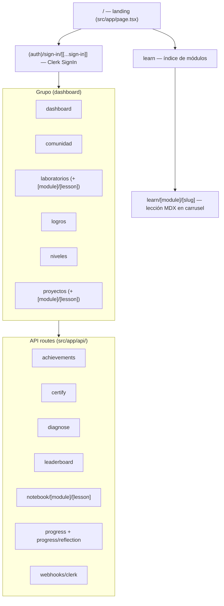
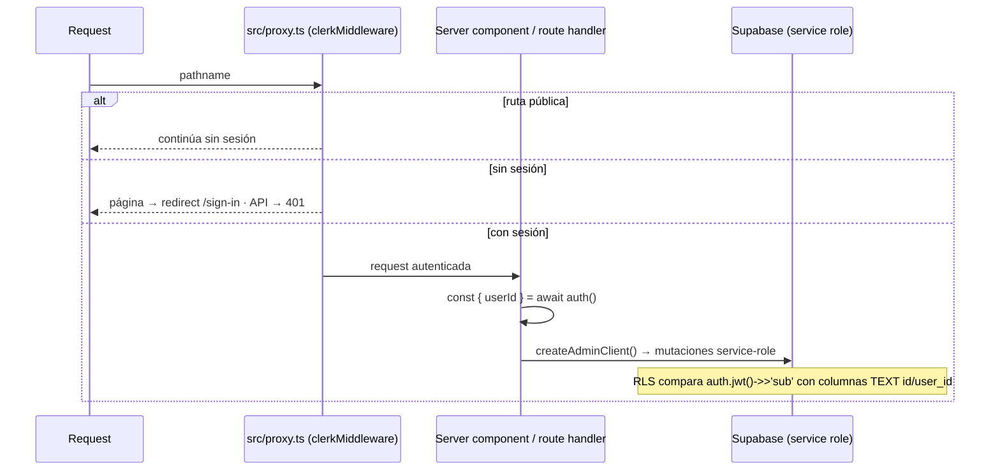
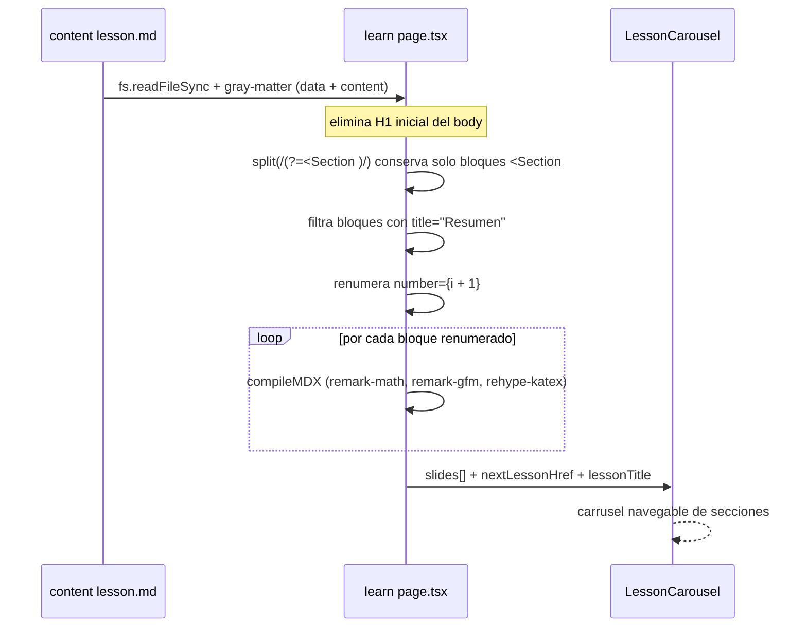
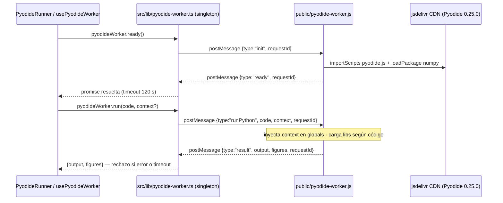

# InVitro-Code — Documento Unificado

<!-- Generated: 2026-08-25 · Fuentes: arquitectura.md + mvp-codebase-memory + mvp-codegraph + mvp-convocatoria-frontend · Stack: Next.js 16.2.10 -->

---

## 0. Alcance

Este documento consolida la información técnica de InVitro-Code en una sola referencia. Fusiona los cuatro documentos previos (`docs/arquitectura.md`, `docs/mvp-codebase-memory.md`, `docs/mvp-codegraph.md`, `docs/mvp-convocatoria-frontend.md`) eliminando contenido de presentación/convocatoria (KPIs, modelo de negocio, métricas de impacto, pilotos B2B) y manteniendo todo lo técnico verificable: diagramas, esquemas de datos, contratos API, arquitectura, stack y convenciones.

Cada afirmación está respaldada por rutas y símbolos concretos del repositorio. Cuando una fuente autoritativa difiere del código observado, **prevalece el código** y la discrepancia se marca con un bloque `> Nota:`.

---

## 1. Descripción del producto

### 1.1 Qué es InVitro-Code

**InVitro-Code** es una plataforma web interactiva estilo Duolingo para que estudiantes de biotecnología aprendan Python, Estadística y Machine Learning resolviendo desafíos de código en el navegador, con datasets biológicos reales y sin necesidad de instalar nada.

El estudiante avanza por lecciones (MDX) → valida con quiz → practica en laboratorios con Python real (Pyodide) → entrega proyectos. Cada acción suma XP, rachas y logros. Todo el contenido orientado al usuario está en **español neutro**; código e identificadores en inglés.

- **Zero-setup**: Python 3.11 + numpy/pandas/scikit-learn/matplotlib ejecutados 100% en el navegador vía Pyodide (Web Worker). Tiempo a primer `print()`: <5s. (`public/pyodide-worker.js` + `src/lib/pyodide-worker.ts`)
- **Contexto BioTech nativo**: Datasets curados: Breast Cancer Wisconsin, Iris, cinéticas de fermentación, estructuras PDB. Cada lección explica *por qué* el modelo importa en el laboratorio. (`src/content/modules/` — 41 lecciones)
- **Aprendizaje activo**: Carrusel MDX interactivo + quizzes + labs ejecutables + notebooks descargables + sistema de XP/rachas/logros/leaderboard. (`learn/[module]/[slug]/page.tsx` + `labs/` + `gamification/`)
- **Escalable**: Arquitectura preparada para migrar de Pyodide (MVP) a API ML dedicada (FastAPI + Docker) sin reescribir el frontend. (`src/lib/supabase/admin.ts` service-role + `supabase-migration.sql`)

### 1.2 Problema que resuelve

La biotecnología moderna genera volúmenes masivos de datos (secuencias genómicas, cinéticas de bioprocesos, imágenes de microscopía) que exigen competencias en Machine Learning. Sin embargo:

- **Brecha curricular**: Los cursos genéricos usan datasets de retail/finanzas que no transfieren al dominio biológico.
- **Barrera de acceso**: Configurar entorno Python (conda, Jupyter, GPU) consume horas y falla frecuentemente. La frustración temprana genera abandono.
- **Desconexión teoría-práctica**: La literatura enseña algoritmos, pero no el flujo completo *preprocesamiento → entrenamiento → evaluación → interpretación* sobre un bioproceso real.

### 1.3 Usuarios objetivo

Estudiantes de biotecnología sin background profundo en programación que necesitan fundamentos de Python, IA, estadística y ML con contexto biotech.

### 1.4 Módulos actuales

| Módulo | Carpeta | Lecciones |
|--------|---------|-----------|
| Python para datos | `python` | 17 (`lesson01_installing_python` … `lesson17_plotly`) |
| Introducción a la IA | `ia` | 4 |
| Machine Learning | `machine-learning` | 10 |
| Estadística | `estadistica` | 10 |
| **Total** | | **41** |

> **Nota**: `supabase-migration.sql` siembra un logro `etica-en-ia` (condición `module_completed: etica`), pero el módulo `etica` **no existe todavía** en el filesystem.

---

## 2. Stack y capas

### 2.1 Stack tecnológico

| Capa | Tecnología | Versión | Responsabilidad |
|------|------------|---------|-----------------|
| Framework | Next.js (App Router + Turbopack) | 16.2.10 | SSR, RSC, API routes co-locadas |
| Lenguaje | TypeScript | 5.x | Contratos tipados, alias `@/*` → `src/*` |
| Estilos | Tailwind CSS | v4 | Utility-first, prose para MDX |
| Contenido | `next-mdx-remote/rsc` | — | MDX compilado en servidor |
| Matemáticas | remark-math + remark-gfm + rehype-katex | — | LaTeX `$...$` en MDX |
| Auth | Clerk (`@clerk/nextjs/server`) | latest | Único proveedor de autenticación |
| Datos | Supabase JS (`@supabase/supabase-js`) | latest | PostgreSQL + RLS + Realtime |
| Python browser | Pyodide | 0.25.0 | Web Worker singleton vía jsdelivr CDN |
| Editor | `@monaco-editor/react` | 4.7.0 | Editor de código con tema oscuro |
| Gráficos | Plotly.js (`plotly.js-dist-min` + `react-plotly.js`) | 3.0.0 | Heatmap, ROC, bar, scatter |
| Deploy | Vercel | — | Frontend + serverless functions |

**Fuentes**: `package.json`, `src/app/`, `src/components/`, `src/lib/`, `next.config.ts`.

### 2.2 Estructura de carpetas

```
InVitro-Code/
├── AGENTS.md
├── README.md
├── PROJECT_STRUCTURE.md
├── package.json / package-lock.json
├── tsconfig.json
├── next.config.ts
├── vitest.config.mts
├── .env.local.example
├── proxy.ts
├── supabase-migration.sql
├── openspec/
│   ├── config.yaml
│   ├── changes/
│   └── specs/
├── public/
│   ├── pyodide-worker.js
│   ├── data/ (diagnostic-trainer, perceptron-trainer, threshold-lab .json)
│   └── interactives/ (demo_*.html, assets/plotly-3.0.0.min.js)
└── src/
    ├── proxy.ts
    ├── app/
    │   ├── layout.tsx, globals.css, page.tsx (landing)
    │   ├── (auth)/sign-in/[[...sign-in]]/page.tsx
    │   ├── (dashboard)/
    │   │   ├── dashboard, niveles, logros, comunidad, proyectos
    │   │   └── laboratorios/ (page.tsx, [module]/[lesson]/page.tsx)
    │   ├── learn/
    │   │   ├── page.tsx
    │   │   └── [module]/[slug]/ (page.tsx, error.tsx, not-found.tsx)
    │   └── api/
    │       ├── achievements, certify, diagnose, leaderboard
    │       ├── notebook/[module]/[lesson]
    │       ├── progress, progress/reflection
    │       └── webhooks/clerk
    ├── components/
    │   ├── lesson/ (index.ts barrel + 22 MDX components)
    │   ├── labs/ (LabHub, LabRunner, QuizRunner, AssignmentViewer)
    │   ├── gamification/ (XPBar, LevelBadge, StreakBadge, etc.)
    │   ├── editor/ (CodeEditor, OutputPanel, PyodideRunner)
    │   ├── layout/ (AppSidebar, InVitroShell, InVitroTopBar)
    │   ├── ui/ (Button, Card, Callout, ...)
    │   └── mdx/ (InteractivePrompt)
    ├── content/
    │   └── modules/{ia, python, estadistica, machine-learning}/lessons/lessonNN_*/
    ├── hooks/
    │   └── usePyodideWorker.ts
    └── lib/
        ├── content/modules.ts
        ├── gamification/ (user, utils, achievements)
        ├── labs/quiz-parser.ts
        ├── mdx/rehype-lab-sections.ts
        ├── pyodide-worker.ts
        ├── supabase/admin.ts
        └── ui/
```

**Fuentes**: `PROJECT_STRUCTURE.md`, `AGENTS.md`, verificación directa del filesystem.

### 2.3 Grafo de dependencias (fan-in/out)

| Capa | Rol | Fan-in | Fan-out |
|------|-----|--------|---------|
| `lib` | core — cliente Supabase, Pyodide singleton, gamificación, contenido | 71 | 0 |
| `components` | core — lesson, labs, gamification, editor | 25 | 5 |
| `app` | entry — páginas + API routes | 0 | 65→lib, 25→components |
| `hooks` | entry — usePyodideWorker | 0 | 1→lib |
| `__tests__` | aislado | 0 | 0 |

**Boundaries (llamadas cross-capa):**
- `app → lib` 65 llamadas (principal acoplamiento)
- `app → components` 25
- `components → lib` 5

**Entry points (20)**: landing `/`, `sign-in`, dashboard (dashboard, comunidad, laboratorios, logros, niveles, proyectos), `learn/[module]/[slug]`, 8 API routes.

**Fuentes**: codebase-memory graph (9443 nodos, 36955 edges, 485 archivos, 18 routes).

### 2.4 Clusters y blast radius

**Clusters CodeGraph** (12, cohesion 0.4–0.77):
- `public` domina (559 miembros, cohesión 0.66)
- `src` cluster 22 (97 miembros: `DashboardPage`, `createAdminClient`, `getModules`) con cohesión 1.0 — bien aislado
- Hotspots de negocio: `lib` (71 inbound), `components` (25)

**Blast radius por símbolo**:
- `pyodide-worker.ts` → afecta `PyodideRunner`, `usePyodideWorker`, `ThresholdLab` — verificar protocolo `requestId` en `public/pyodide-worker.js`
- `lib/content/modules.ts` (`getModules`, `getLessonSlugs`) → afecta todas las páginas `learn`, `laboratorios`, `proyectos`, `comunidad`, `dashboard`
- `supabase-migration.sql` → blast radius infra: requiere re-ejecutar en Supabase SQL Editor

---

## 3. Arquitectura del sistema

### 3.1 Mapa de rutas

Fuente: inventario de `page.tsx` y `route.ts` bajo `src/app/`, más las reglas de acceso en `src/proxy.ts`.



### 3.2 Reglas de acceso (proxy.ts)

`src/proxy.ts` es el middleware de Next.js (`clerkMiddleware`):

- **Rutas públicas declaradas**: `/`, `/sign-in`, `/sign-up`, `/api/webhooks/clerk`, `/api/diagnose`.
- **Sin sesión**: páginas → redirección a `/sign-in` con `redirect_url`; rutas `/api/*` → respuesta JSON con estado `401`.
- El matcher excluye internos de Next.js (`_next`) y archivos estáticos, pero siempre corre para `/api/*`, `/trpc/*` y `/__clerk/*`.

**Detalle dinámico**:
- `(dashboard)/laboratorios/[module]/[lesson]/page.tsx` resuelve contenido por convención de directorios en `src/content/modules/{module}/lessons/{lesson}/`; si el directorio no existe, llaman `notFound()`.
- La página de laboratorio exige `lab.md` (obligatorio) y acepta opcionalmente `quiz.md` y `notebook.ipynb`.
- `learn/[module]/[slug]/error.tsx` y `learn/[module]/[slug]/not-found.tsx` manejan errores e lecciones inexistentes.

### 3.3 Flujo de datos MVP → evolución

```
┌─────────────┐     ┌──────────────┐     ┌─────────────────┐     ┌──────────────┐
│  Usuario     │────▶│  Frontend    │────▶│  API Gateway    │────▶│  ML Service  │
│ (Browser)    │◀────│  Next.js 16  │◀────│  Next.js API    │◀────│  FastAPI     │
└─────────────┘     └──────────────┘     └─────────────────┘     └──────────────┘
                           │                     │                      │
                           │                     ▼                      ▼
                           │              ┌─────────────┐        ┌──────────┐
                           │              │  Supabase   │        │ Storage  │
                           │              │  Postgres   │        │ S3 /     │
                           └─────────────▶│  + RLS      │        │ Supabase │
                                          └─────────────┘        │ Storage  │
                                                                 └──────────┘

Fase MVP actual (Pyodide): ─ ─ ─ ─ ─ ─ ─ ─ ─ ─ ─ ─ ─ ─ ─ ─ ─ ─ ─ ─ ─ ─ ─ ─
  Usuario → Next.js → Pyodide Worker (navegador, sin backend) → Supabase (progreso)
  [Latencia: 0ms red, límite: RAM del navegador, datasets <50MB]

Fase 1 evolución (API ML): ─ ─ ─ ─ ─ ─ ─ ─ ─ ─ ─ ─ ─ ─ ─ ─ ─ ─ ─ ─ ─ ─ ─ ─
  Usuario → Next.js → /api/ml/* → FastAPI (Docker) → Supabase + Storage
  [Latencia: 200-800ms, datasets hasta 500MB, entrenamiento server-side]
```

**Flujo detallado (Fase 1):**

1. **Ingesta**: Usuario sube CSV/FASTA vía Dropzone → `POST /api/datasets` → validación esquema → persiste en Supabase Storage (`datasets` bucket) + metadata en tabla `datasets`.
2. **Preprocesamiento**: Frontend solicita `POST /api/ml/preprocess` → backend aplica pipeline (imputación, encoding, escalado) → retorna preview JSON + `preprocessed_dataset_id`.
3. **Entrenamiento**: `POST /api/ml/train` con `dataset_id`, `model_type`, `hyperparams` → job asíncrono → polling `GET /api/ml/jobs/{job_id}` → al completar, persiste `models` + `metrics`.
4. **Inferencia**: `POST /api/ml/predict` con `model_id` + payload → retorna predicciones JSON.
5. **Visualización**: `GET /api/ml/metrics/{job_id}` → JSON para Plotly (curva ROC, matriz confusión, pérdida vs epochs).

### 3.4 Boundaries cross-capa

| Origen | Destino | Llamadas | Nota |
|--------|---------|----------|------|
| `app` | `lib` | 65 | Principal acoplamiento — API routes + pages |
| `app` | `components` | 25 | Páginas usan componentes UI |
| `components` | `lib` | 5 | Componentes acceden a gamificación, Pyodide |
| `hooks` | `lib` | 1 | `usePyodideWorker` → `pyodideWorker` |

No se detectaron ciclos entre capas. `__tests__` es aislado (fan-in/out 0).

---

## 4. Autenticación y datos

### 4.1 Diagrama de secuencia auth



**Reglas clave:**
- **Clerk es el único proveedor de auth.** Supabase Auth no se usa.
- **Escrituras servidor**: siempre con `createAdminClient()` (`src/lib/supabase/admin.ts`), que usa `NEXT_PUBLIC_SUPABASE_URL` + `SUPABASE_SERVICE_ROLE_KEY`. Nunca usar la anon key para escrituras servidor.
- **RLS**: las políticas comparan `auth.jwt() ->> 'sub'` contra columnas TEXT `id` / `user_id` — **nunca** `auth.uid()` (que depende de Supabase Auth, aquí inexistente).

### 4.2 Esquema de tablas y RLS

Esquema real según `supabase-migration.sql` — **6 tablas**, todas con RLS habilitado:

| Tabla | Columnas notables | Políticas RLS |
|-------|-------------------|---------------|
| `profiles` | `id` (TEXT, = Clerk user id), `email`, `username` | lectura/edición propias vía `(auth.jwt() ->> 'sub') = id` |
| `progress` | `user_id`, `module_slug`, `lesson_slug`, `completed`, `xp_earned`, `completed_at` | lectura/inserción/actualización propias vía `user_id` |
| `streaks` | `user_id`, `current_streak`, `longest_streak`, `last_active_date` | lectura/inserción/actualización propias vía `user_id` |
| `reflection_completions` | `user_id`, `block_id`, `xp_earned`, `completed_at` | lectura/inserción propias vía `user_id` |
| `achievements` | catálogo global: `slug`, `title`, `xp_reward`, `condition_type`, `condition_value` | lectura para cualquier usuario autenticado (`sub IS NOT NULL`) |
| `user_achievements` | desbloqueos por usuario: `user_id`, achievement, `unlocked_at` | lectura/inserción propias vía `user_id` |

También define funciones SQL `get_leaderboard(limit_n)` y `get_leaderboard_rank(target_user_id)` usadas por `/api/leaderboard` y `(dashboard)/comunidad` mediante `.rpc(...)`.

> **Nota**: `AGENTS.md` lista solo cuatro tablas (`profiles`, `progress`, `streaks`, `reflection_completions`), pero `supabase-migration.sql` define además `achievements` y `user_achievements`. Este documento registra las 6 tablas observadas en el código/migración.

### 4.3 Webhook Clerk

`POST /api/webhooks/clerk` verifica firmas Svix con `CLERK_SIGNING_SECRET` y, ante `user.created`, hace upsert en `profiles` (id, email, username).

### 4.4 Publicación supabase_realtime

`supabase-migration.sql` agrega a la publicación `supabase_realtime`: `profiles`, `progress`, `streaks`, `reflection_completions`, `achievements`, `user_achievements`. Cualquier tabla nueva consumida por widgets realtime debe añadirse a esa publicación.

---

## 5. Pipeline de contenido (MDX)

### 5.1 Estructura filesystem

Cada lección vive en `src/content/modules/{module}/lessons/{lesson}/`:

```
modules/<modulo>/
├── module.json          # name (display) y order (orden)
├── README.md
├── notebooks/
├── subunits/            # (solo machine-learning)
└── lessons/
    └── lessonNN_<slug>/
        ├── lesson.md    # MDX + YAML frontmatter
        ├── quiz.md
        ├── lab.md
        ├── assignment.md
        ├── notebook.ipynb
        ├── references.bib
        └── slides.md    # opcional
```

**Ordenación basada en sistema de archivos**: las lecciones se ordenan por nombre de directorio con prefijo `lessonNN_` (lexicográfico). Renombrar un directorio reordena el módulo.

### 5.2 Frontmatter keys literales

El código lee las claves con su capitalización exacta:
- `Lesson Title`, `Lesson Number`, `Module`, `Learning Objectives`, `Estimated Duration`, `Prerequisites`, `Difficulty`

(`renderHeader` en la página de lección; `getLessonTitle` en `src/lib/content/modules.ts` acepta `"Lesson Title"` con fallback a `"title"`).

### 5.3 Flujo de renderizado de lección



**Detalles verificados** (`src/app/learn/[module]/[slug]/page.tsx`):
- El corte se hace sobre `bodyContent` (tras quitar el H1): `split(/(?=<Section )/)`, se conservan solo bloques que empiezan con `<Section` y se descarta cualquier bloque que contenga `title="Resumen"`.
- La renumeración reemplaza `number={\d+}` por `number={${i + 1}}`.
- Cada bloque se compila individualmente con `compileMDX`; si no queda ningún slide, la página cae a renderizar el cuerpo completo con `MDXRemote`.
- El flag de servidor `FEATURE_FLAG_CERTIFY === "true"` se inyecta en el mapa de componentes (`CodeEditor`) para que el cliente nunca lea `process.env`.

### 5.4 Regla de registro de componentes MDX

Todo componente usado dentro del contenido debe exportarse desde `src/components/lesson/index.ts` **y** aparecer en el mapa `components` de la página de lección (22 exports actuales en el barrel). Un componente presente en el MDX pero no registrado rompe la compilación de esa sección.

Las fórmulas usan `remark-math` + `rehype-katex` — preservar `$...$` LaTeX.

### 5.5 Render lab (rehype-lab-sections)

El render de laboratorio (`laboratorios/[module]/[lesson]/page.tsx`) usa `lab.md` + plugin `rehype-lab-sections.ts` (→ `LabHeader`, `LabCallout`, `ReflectionPrompt`), fences `python` → `PyodideRunner`, `bash` → `CodeBlock`. Convención bilingüe EN/ES: `# Lab:` → `LabHeader`; `## Objetivo/Duración/Dataset/Entregables` → `LabCallout`; `**Preguntas para reflexionar:**` → `ReflectionPrompt`.

---

## 6. Python en el navegador: Pyodide

### 6.1 Diagrama de secuencia Pyodide



### 6.2 Protocolo worker

El worker real es un archivo estático en `public/` (no pasa por el bundler). Todos los consumidores pasan por el **singleton** `pyodideWorker` exportado desde `src/lib/pyodide-worker.ts`: una única instancia de Worker por sesión de página, con inicialización perezosa, cola de peticiones y correlación por `requestId`.

- **Petición**: `{ type: "init" | "runPython", code?, context?, requestId }` (el worker también atiende `ping` → `pong`).
- **Respuesta**: `{ type: "ready" | "result" | "error", output?, error?, figures?, requestId }`. El cliente ignora mensajes sin `requestId` y respuestas con `requestId` desconocido.

### 6.3 Carga de librerías

- **Siempre al inicializar**: `numpy`.
- **Detección por contenido del código** (`code.includes(...)`): `scikit-learn` + `matplotlib` + `pandas`; `scipy`.
- **Bajo demanda vía micropip** (PyPI): `seaborn`, `plotly` + `pandas`.
- Las figuras de matplotlib/plotly se capturan como strings (JSON/base64) y se devuelven en `figures[]` para renderizarlas en `VisualizationPanel`.

### 6.4 Blast radius del worker singleton

Consumidores verificados: `PyodideRunner` (usado por `LessonCodeEditor` y `LabCodeBlock`) llama `pyodideWorker.ready()` + `run()`; `usePyodideWorker` usa la misma API. El timeout de inicialización es de 120 s (`120_000 ms`) en `ensureReady()`.

> **Nota de mantenimiento**: cualquier cambio al protocolo debe reflejarse en **ambos** archivos — `public/pyodide-worker.js` y `src/lib/pyodide-worker.ts` deben mantenerse sincronizados.

### 6.5 Limitación: requiere red

Como todo se descarga del CDN de jsdelivr (y paquetes extra desde PyPI), los laboratorios requieren conexión a internet; sin red fallan.

---

## 7. Superficie de API

### 7.1 API actual

Todas exigen sesión Clerk salvo las marcadas públicas en `src/proxy.ts` (`/api/webhooks/clerk`, `/api/diagnose`).

| Ruta | Método | Función |
|------|--------|---------|
| `/api/achievements` | GET | Devuelve estado de logros evaluado con `evaluateAchievements` contra datos reales |
| `/api/certify` | POST | Certificación de ejercicios. **Stub MVP**: con `FEATURE_FLAG_CERTIFY !== "true"` devuelve `503` con `certified: false`; si el flag está activo responde siempre `certified: true` (`testsPassed: 3`). El bloque E2B está marcado como punto de integración en `src/app/api/certify/route.ts` |
| `/api/diagnose` | GET | Público. Diagnóstico sin sesión |
| `/api/leaderboard` | GET | Ranking vía RPC `get_leaderboard` + posición propia con `get_leaderboard_rank` |
| `/api/notebook/[module]/[lesson]` | GET | Sirve `notebook.ipynb` de la lección para descarga |
| `/api/progress` | POST | Registra lección completada (upsert en `progress`), calcula XP con `calcXpForLesson`, actualiza racha en `streaks` y evalúa logros (fallo no fatal) |
| `/api/progress/reflection` | POST | Inserta en `reflection_completions` (+5 XP); violación única (`23505`) → `xpEarned: 0, isNew: false` |
| `/api/webhooks/clerk` | POST | Público (verificación Svix). Upsert de perfil ante `user.created` |

**Patrón común**: `const { userId } = await auth()` → `401` si falta → `createAdminClient()` → operación sobre Supabase → `NextResponse.json`. Nunca se usa la anon key en escrituras servidor.

### 7.2 API Fase 1 — ML

**Base URL**: `https://api.invitro-code.com/v1` (Fase 1) · Auth: `Authorization: Bearer <Clerk JWT>` · Todos responden `application/json`.

#### a) Carga de datasets y validación

**`POST /api/datasets` — Subir dataset**

```http
POST /api/datasets
Content-Type: multipart/form-data
Authorization: Bearer <token>

Form fields:
  file: <binary> (CSV, TSV, FASTA, XLSX — max 50MB MVP, 500MB Fase 3)
  name: "fermentacion_lote_42.csv"
  description: "Cinética de E. coli — glucosa vs biomasa"
  module_slug: "machine-learning"  // opcional, para vincular a lección
```

```json
// 201 Created
{
  "dataset_id": "d_8f3a1b2c",
  "name": "fermentacion_lote_42.csv",
  "rows": 1240,
  "columns": ["tiempo_h", "glucosa_gL", "biomasa_gL", "producto_gL"],
  "dtypes": {"tiempo_h": "float64", "glucosa_gL": "float64"},
  "preview": [
    {"tiempo_h": 0, "glucosa_gL": 10.0, "biomasa_gL": 0.1},
    {"tiempo_h": 2, "glucosa_gL": 8.4, "biomasa_gL": 0.45}
  ],
  "validation": {
    "valid": true,
    "warnings": ["12 valores nulos en producto_gL (0.9%)"],
    "errors": []
  },
  "storage_path": "datasets/user_abc123/d_8f3a1b2c.csv",
  "created_at": "2026-08-25T10:00:00Z"
}

// 400 Bad Request — validación fallida
{
  "error": "VALIDATION_FAILED",
  "details": ["Columna 'secuencia' contiene caracteres no FASTA", "Archivo excede 50MB"]
}
```

**`GET /api/datasets` — Listar datasets del usuario**

```json
// 200 OK
{
  "datasets": [
    {
      "dataset_id": "d_8f3a1b2c",
      "name": "fermentacion_lote_42.csv",
      "rows": 1240,
      "created_at": "2026-08-25T10:00:00Z"
    }
  ],
  "total": 1
}
```

**`POST /api/datasets/validate` — Validación sin persistir (preview rápido)**

```json
// Request
{ "preview_rows": 5, "file_base64": "dGllbXBv..." }
// Response 200
{ "valid": true, "columns": ["a","b"], "suggested_task": "regression" }
```

#### b) Entrenamiento e inferencia

**`POST /api/ml/train` — Entrenar modelo**

```json
// Request
{
  "dataset_id": "d_8f3a1b2c",
  "task": "classification", // classification | regression | clustering
  "model_type": "random_forest", // logistic_regression | random_forest | svm | kmeans | perceptron
  "target_column": "producto_gL",
  "feature_columns": ["tiempo_h", "glucosa_gL", "biomasa_gL"],
  "test_size": 0.2,
  "hyperparams": {
    "n_estimators": 100,
    "max_depth": 8,
    "random_state": 42
  },
  "preprocessing": {
    "impute_strategy": "mean",
    "scale": "standard"
  }
}

// 202 Accepted — job asíncrono
{
  "job_id": "job_9e2f1a",
  "status": "queued",
  "estimated_time_s": 45,
  "poll_url": "/api/ml/jobs/job_9e2f1a"
}
```

**`GET /api/ml/jobs/{job_id}` — Estado del job**

```json
// 200 OK — running
{ "job_id": "job_9e2f1a", "status": "running", "progress": 0.6, "logs": ["Fitting 100 trees..."] }
// 200 OK — completed
{
  "job_id": "job_9e2f1a",
  "status": "completed",
  "model_id": "m_4c5d6e",
  "metrics": {"accuracy": 0.92, "f1": 0.89, "roc_auc": 0.94},
  "artifacts": {
    "model_path": "models/m_4c5d6e.pkl",
    "confusion_matrix": [[45,3],[2,50]],
    "feature_importance": {"glucosa_gL": 0.42, "biomasa_gL": 0.35}
  },
  "created_at": "2026-08-25T10:01:00Z"
}
// 200 OK — failed
{ "job_id": "job_9e2f1a", "status": "failed", "error": "Target column has NaN after imputation" }
```

**`POST /api/ml/predict` — Inferencia**

```json
// Request
{
  "model_id": "m_4c5d6e",
  "inputs": [
    {"tiempo_h": 10, "glucosa_gL": 2.1, "biomasa_gL": 4.2},
    {"tiempo_h": 12, "glucosa_gL": 1.8, "biomasa_gL": 4.8}
  ]
}
// 200 OK
{
  "predictions": [3.2, 3.8],
  "model_id": "m_4c5d6e",
  "latency_ms": 42
}
```

**Compatibilidad MVP (Pyodide)**: Durante Fase 1, `POST /api/ml/train` con header `X-Execution-Mode: pyodide` ejecuta en el Worker del navegador (sin backend) y persiste solo métricas en Supabase — permite demo offline.

#### c) Métricas y gráficos

**`GET /api/ml/metrics/{job_id}` — Métricas + payload Plotly**

```json
// 200 OK
{
  "job_id": "job_9e2f1a",
  "metrics": {
    "accuracy": 0.92,
    "precision": 0.91,
    "recall": 0.89,
    "f1": 0.90,
    "roc_auc": 0.94,
    "mse": null,
    "r2": null
  },
  "plots": {
    "confusion_matrix": {
      "type": "heatmap",
      "z": [[45,3],[2,50]],
      "x": ["Pred 0","Pred 1"],
      "y": ["True 0","True 1"]
    },
    "roc_curve": {
      "type": "scatter",
      "x": [0, 0.05, 0.12, 1],
      "y": [0, 0.78, 0.92, 1],
      "mode": "lines"
    },
    "feature_importance": {
      "type": "bar",
      "x": [0.42, 0.35, 0.23],
      "y": ["glucosa_gL","biomasa_gL","tiempo_h"],
      "orientation": "h"
    },
    "learning_curve": {
      "type": "scatter",
      "x": [1,2,3,4,5],
      "y": [0.65, 0.78, 0.85, 0.89, 0.92],
      "mode": "lines+markers"
    }
  },
  "plotly_json": "{...Plotly JSON completo para render directo...}",
  "generated_at": "2026-08-25T10:01:00Z"
}
```

**`GET /api/ml/models` — Modelos del usuario**

```json
{ "models": [{"model_id":"m_4c5d6e","task":"classification","accuracy":0.92,"created_at":"2026-08-25T10:01:00Z"}], "total": 1 }
```

### 7.3 Regla: no romper endpoints existentes

`POST /api/progress`, `POST /api/progress/reflection`, `GET /api/leaderboard`, `GET /api/achievements`, `POST /api/certify` (stub E2B) permanecen idénticos. Cualquier cambio en la API Fase 1 no debe alterar estos contratos.

---

## 8. Gamificación y tiempo real

### 8.1 Flujo XP / racha / logros

Flujo disparado por `POST /api/progress`:

1. `calcXpForLesson(moduleSlug, lessonSlug)` calcula el XP de la lección (`src/lib/gamification/utils.ts`).
2. Se hace upsert en `progress` con `completed: true`, `xp_earned` y `completed_at`.
3. Lógica de racha (`isSameDay` / `isNextDay`): mismo día mantiene la racha; día consecutivo suma 1; hueco reinicia a 1. `longest_streak` se actualiza si corresponde.
4. `evaluateAchievements(userId, supabase)` evalúa condiciones del catálogo `achievements` contra datos reales e inserta desbloqueos en `user_achievements`; su fallo nunca rompe el flujo (envuelto en try/catch).

XP total y niveles: `getTotalXp(userId, supabase)` agrega XP de `progress` + `reflection_completions`; `calcLevel` y `rankTitle` derivan nivel y título.

### 8.2 Componentes de gamificación

Componentes en `src/components/gamification/`:
- `XPBar` — barra de XP animada
- `LevelBadge` — badge de nivel actual
- `StreakBadge` — indicador de racha
- `ModuleProgress` — progreso por módulo
- `AchievementCard` — tarjeta de logro desbloqueado

### 8.3 Leaderboard (RPCs SQL)

Funciones `get_leaderboard(limit_n)` y `get_leaderboard_rank(target_user_id)` en `supabase-migration.sql`, expuestas vía `/api/leaderboard` y `(dashboard)/comunidad/page.tsx` mediante `.rpc(...)`.

**Requisito de publicación realtime**: los widgets que se suscriben a cambios usan la publicación `supabase_realtime`. En `supabase-migration.sql` están agregadas: `profiles`, `progress`, `streaks`, `reflection_completions`, `achievements`, `user_achievements`. Cualquier tabla nueva consumida por widgets realtime debe añadirse a esa publicación.

---

## 9. Mapeo Frontend y UX/UI

### 9.1 Sitemap

```
/
├── / (Landing — Hero: "Aprende IA con datos de tu laboratorio")
│   ├── Módulos (cards con progreso)
│   └── CTA → /sign-in
│
├── /sign-in, /sign-up (Clerk)
│
├── /learn (Índice — protegido)
│   ├── /learn (lista módulos + lecciones)
│   └── /learn/[module]/[slug] (Carrusel MDX — corazón pedagógico)
│       ├── Sections (teoría + interactivos)
│       ├── CodeEditor (Monaco) + PyodideRunner + OutputPanel
│       └── CompleteLessonButton → POST /api/progress
│
├── (dashboard) — Área autenticada (InVitroShell + AppSidebar)
│   ├── /dashboard (Resumen: XP, racha, próxima lección)
│   ├── /laboratorios
│   │   ├── /laboratorios (Hub — cards por lección con hasLab/hasQuiz/hasNotebook)
│   │   └── /laboratorios/[module]/[lesson] (LabRunner — tabs: Instrucciones | Código | Quiz | Entrega)
│   ├── /proyectos (ProjectHub — assignments con rúbrica)
│   │   └── /proyectos/[module]/[lesson] (AssignmentViewer)
│   ├── /niveles (Progresión XP → nivel + rankTitle)
│   ├── /logros (Achievements — 17 logros, categorías Novato/Analista/Investigador)
│   └── /comunidad (Leaderboard — get_leaderboard RPC)
│
└── [NUEVO Fase 1] /datasets, /ml/*
    ├── /datasets (Gestor de datasets — Dropzone + tabla)
    ├── /datasets/[id] (Preview + validación + botón "Entrenar modelo")
    ├── /ml/train (Consola de entrenamiento)
    ├── /ml/models (Galería de modelos)
    └── /ml/predict (Playground de inferencia)
```

**Navegación**: `InVitroShell` (sidebar colapsable, CSS var `--sidebar-offset`) + `InVitroTopBar` (XPBar, StreakBadge, avatar Clerk). Middleware `proxy.ts` protege todo excepto `/`, `/sign-in`, `/sign-up`, `/api/webhooks/clerk`, `/api/diagnose`.

### 9.2 Flujo paso a paso — caso Ana

**Persona**: Ana, estudiante de 5° año Biotecnología, tiene CSV de fermentación (tiempo, glucosa, biomasa, producto).

| Paso | Pantalla | Acción usuario | Sistema | Componente UI |
|------|----------|----------------|---------|---------------|
| **1** | `/laboratorios` | Clic "Nuevo análisis" o entra a lección con lab | — | `Button` + `LabCard` |
| **2** | `/datasets` | Arrastra `fermentacion.csv` al Dropzone | `POST /api/datasets` → valida, muestra preview 5 filas + warnings | `DatasetDropzone` |
| **3** | `/datasets/[id]` | Revisa preview, selecciona columnas: target=`producto_gL`, features=`[tiempo_h, glucosa_gL]` | `GET /api/datasets/{id}` | `DatasetPreviewTable` + `ColumnSelector` |
| **4** | `/ml/train` | Elige task=`regression`, model=`random_forest`, ajusta `n_estimators` con slider, clic "Entrenar" | `POST /api/ml/train` → 202 → polling `GET /api/ml/jobs/{id}` cada 2s | `ModelSelector`, `HyperparamForm`, `TrainingConsole` |
| **5** | `/ml/train` (running) | Observa logs en tiempo real: "Fitting 100 trees... 60%" | SSE o polling | `TrainingConsole` |
| **6** | `/ml/train` (done) | Ve métricas: R²=0.89, MSE=0.12 + gráficos | `GET /api/ml/metrics/{job_id}` → Plotly JSON | `MetricsDashboard` + `PlotlyViewer` |
| **7** | `/ml/predict` | Ingresa nuevos valores → "Predecir" | `POST /api/ml/predict` → 42ms | `PredictionPlayground` |
| **8** | `/dashboard` | Ve +120 XP, racha +1, logro "ML Práctico" desbloqueado | `POST /api/progress` + `evaluateAchievements` | `XPBar`, `AchievementCard`, `StreakBadge` |

**Flujo alternativo (MVP Pyodide)**: Pasos 2-6 ocurren 100% en navegador: `PyodideRunner` ejecuta `sklearn` local, sin `POST /api/datasets`.

### 9.3 Componentes UI requeridos

| Componente | Descripción | Props clave | Estado |
|------------|-------------|-------------|--------|
| **DatasetDropzone** | Drag & drop con validación, preview y estados | `onUpload(file)`, `accept=".csv,.tsv,.fasta"`, `maxSize=50MB` | Nuevo Fase 1 |
| **DatasetPreviewTable** | Tabla paginada (5 filas) + badges de dtype + warnings | `columns`, `rows`, `dtypes`, `validation` | Nuevo |
| **ColumnSelector** | Checkboxes para target/features con validación | `columns`, `target`, `features`, `onChange` | Nuevo |
| **ModelSelector** | Cards seleccionables (icon + nombre + descripción) | `task`, `selected`, `onSelect` | Nuevo |
| **HyperparamForm** | Form dinámico por modelo (sliders, inputs, tooltips) | `modelType`, `values`, `onChange` | Nuevo |
| **TrainingConsole** | Consola tiempo real (logs, progress %, elapsed, cancel) | `jobId`, `logs`, `progress`, `status` | Nuevo |
| **MetricsDashboard** | Grid de KPI cards con delta vs baseline | `metrics` | Nuevo |
| **PlotlyViewer** | Wrapper `react-plotly.js` con responsive + descarga | `plotlyJson`, `height` | Existe (evolucionar) |
| **PredictionPlayground** | Form auto-generado desde `feature_columns` + Predict | `modelId`, `features` | Nuevo |
| **LabRunner** | Tabs (Instrucciones/Código/Quiz/Entrega) + PyodideRunner | `lab.md`, `quiz.md` | Existe |
| **CodeEditor** | Monaco + tema oscuro + `FEATURE_FLAG_CERTIFY` | `code`, `onChange`, `language` | Existe |
| **PyodideRunner** | Ejecuta `pyodideWorker.run()` + OutputPanel + VisualizationPanel | `code`, `context` | Existe |
| **XPBar / StreakBadge / AchievementCard** | Gamificación con realtime Supabase | `xp`, `streak`, `achievements` | Existe |

### 9.4 Stack Frontend recomendado

| Capa | Tecnología | Justificación | Versión |
|------|------------|---------------|---------|
| **Framework** | Next.js 16 App Router + Turbopack | SSR para SEO + RSC para MDX + API routes co-locadas | 16.2+ |
| **Lenguaje** | TypeScript (strict) | Contratos API tipados, `createAdminClient` safety | 5.x |
| **Estilos** | Tailwind CSS v4 + `tailwindcss/typography` | Utility-first, prose para MDX | 4.x |
| **UI Kit** | shadcn/ui (Radix + Tailwind) | Accesible, componible, copy-paste | latest |
| **Gráficos** | Plotly.js (`plotly.js-dist-min` + `react-plotly.js`) | Ya en bundle, heatmap/ROC/bar/scatter sin backend | 3.0.0 |
| **Editor** | `@monaco-editor/react` | Ya integrado, tema oscuro, Pyodide compatible | 4.7.0 |
| **Estado** | React `useState` + `usePyodideWorker` singleton + SWR | Polling `GET /api/ml/jobs/{id}` cada 2s | SWR 2.x |
| **Auth** | Clerk (`@clerk/nextjs`) | Ya en producción, middleware `proxy.ts` | latest |
| **Datos** | Supabase JS + `supabase_realtime` | RLS con `auth.jwt()->>'sub'`, realtime para XP/leaderboard | latest |
| **Validación** | Zod (frontend) + `gray-matter` (MDX frontmatter) | Contratos `POST /api/datasets` y `POST /api/ml/train` | 3.x |
| **Testing** | Vitest + `*.test.ts` existentes | `quiz-parser.test.ts`, `rehype-lab-sections.test.ts` | 1.x |
| **Deploy** | Vercel (frontend) + Docker (FastAPI ML service) | Vercel para Next.js, VPS/Render para FastAPI | — |

### 9.5 Design tokens

Tailwind v4 + `globals.css` (CSS vars `--sidebar-offset`), tipografía `next/font`, iconos `lucide-react`.

---

## 10. Complejidad y tests

### 10.1 Estado actual de tests

- `strict_tdd:false` en `openspec/config.yaml`.
- Vitest config existe pero npm `test` no usado en CI.
- Tests reales: `gamification/utils.test.ts`, `labs/quiz-parser.test.ts`, `mdx/rehype-lab-sections.test.ts`.
- Artefacto manual: `src/__tests__/requestId-descarte.test.mjs` (5 tests race condition ThresholdLab).
- Sin `eslint` (Next 16 removió `next lint`). Gate confiable: `type-check` + `build`.

### 10.2 Gates de verificación

| Comando | Propósito | Cuándo ejecutar |
|---------|-----------|-----------------|
| `npm run type-check` | Gate estático confiable (TSC) | Local, antes de commit |
| `npm run build` | Integración real (Vercel también lo corre) | CI, antes de deploy |
| `npm run lint` | **No disponible** — Next 16 eliminó `next lint`, sin config ESLint | No usar |

**Nota RAM**: `npm run build` con Turbopack puede OOM en máquinas <2GB. Localmente alcanza con `type-check` + dev server.

---

## 11. MVP — alcance mínimo

### 11.1 Entra MVP

- [x] 41 lecciones navegables + carrusel MDX
- [x] Labs Pyodide ejecutables (numpy siempre, resto lazy) + notebooks descargables
- [x] Progreso XP + racha (isSameDay/isNextDay) + 17 logros + leaderboard (RPCs)
- [x] Auth Clerk + RLS (6 tablas)
- [x] Deploy Vercel
- [x] Webhook Clerk → profiles
- [x] Realtime (profiles, progress, streaks, reflections, achievements, user_achievements)

### 11.2 No entra MVP (post-MVP)

- [ ] Certificación E2B (`/api/certify` stub → integración sandbox)
- [ ] Módulo `etica` (7 lecciones) — logro `etica-en-ia` sin contenido
- [ ] Tests cobertura amplia, lint
- [ ] Offline Pyodide (hoy requiere CDN)
- [ ] API ML dedicada (FastAPI + Docker)

### 11.3 Riesgos conocidos

- **RAM**: Turbopack build OOM en máquinas <2GB — usar `type-check` local, build en Vercel.
- **Red**: Labs Pyodide requieren conexión a internet (CDN jsdelivr + PyPI).
- **Estátics de vendor**: `public/interactives/assets/plotly-3.0.0.min.js` domina fan-in (2324 hits) — vendor, no business.

---

## 12. Roadmap y ejecución

### 12.1 Tabla de fases

| Fase | Nombre | Duración | Objetivo | Entregables | Criterio de éxito |
|------|--------|----------|----------|-------------|-------------------|
| **1** | Core ML API | 4 semanas | Backend ML funcional desacoplado del frontend | FastAPI service (5 endpoints), Supabase Storage + tablas, validación Zod + tests, Docker + CI | `POST /api/ml/train` con CSV 1k filas → 202 → `completed` < 60s |
| **2** | Frontend MVP | 6 semanas | UI completa para flujo §9.2 sobre API Fase 1 | 5 componentes nuevos + sitemap + integración Clerk JWT → FastAPI + fallback Pyodide | Usuario completa flujo 1-8 en <15 min |
| **3** | Escalabilidad | 8 semanas | Producción multiusuario, 500 usuarios | Queue Celery/Redis, rate limiting, certificación E2B, módulo `etica`, observabilidad | 500 usuarios, p95 train <2s |

**Dependencias**: Fase 2 bloqueada hasta Fase 1 (contrato API). Fase 3 requiere métricas Fase 2.

### 12.2 Infraestructura y costo

**MVP (Fase 1-2) — Costo estimado $25-40/mes:**

| Componente | Servicio | Configuración | Costo |
|------------|----------|---------------|-------|
| Frontend | Vercel (Hobby → Pro) | `next build` Turbopack, env vars | $0-20/mes |
| ML API | Render / Railway / VPS (Hetzner CX22) | Docker, 2 vCPU / 4GB RAM | $15-30/mes |
| DB + Storage | Supabase Cloud (Free → Pro) | Postgres + Storage 50GB + Realtime | $0-25/mes |
| Auth | Clerk (Free) | 10k MAU incluidos | $0 |
| CI/CD | GitHub Actions | `type-check` → `build` → deploy | $0 |

```yaml
# docker-compose.yml (Fase 1)
services:
  ml-api:
    build: ./ml-service  # FastAPI + scikit-learn + pandas
    ports: ["8000:8000"]
    env: [SUPABASE_URL, SUPABASE_SERVICE_KEY, CLERK_JWT_KEY]
    deploy: { resources: { limits: { memory: 2G } } }

  # Frontend: Vercel (no Docker, deploy vía git push)
  # DB: Supabase Cloud (Postgres + Storage + Realtime)
  # Auth: Clerk Cloud
```

### 12.3 CI/CD (GitHub Actions)

```yaml
# .github/workflows/ci.yml
on: [push]
jobs:
  verify:
    runs-on: ubuntu-latest
    steps:
      - uses: actions/checkout@v4
      - uses: actions/setup-node@v4 # Node 22 (Next 16 requiere >=20.9)
      - run: npm ci
      - run: npm run type-check  # gate estático (no lint)
      - run: npm run build       # gate real (Vercel también lo corre)
  deploy-ml:
    if: github.ref == 'refs/heads/main'
    runs-on: ubuntu-latest
    steps:
      - run: docker build -t ghcr.io/org/ml-api:${{ github.sha }} ./ml-service
      - run: docker push ghcr.io/org/ml-api:${{ github.sha }}
      # Render/Railway auto-deploy via webhook
```

### 12.4 Variables de entorno

```
NEXT_PUBLIC_CLERK_PUBLISHABLE_KEY=
CLERK_SECRET_KEY=
CLERK_SIGNING_SECRET=
NEXT_PUBLIC_SUPABASE_URL=
NEXT_PUBLIC_SUPABASE_ANON_KEY=
SUPABASE_SERVICE_ROLE_KEY=
FEATURE_FLAG_CERTIFY=false  # true solo con E2B en Fase 3
ML_API_URL=https://ml.invitro-code.com  # Fase 1
```

---

## 13. Convenciones de mantenimiento

### 13.1 Contenido, commits, docs

- **Contenido**: todo el material educativo es español neutro; identificadores, rutas y código permanecen en inglés tal cual.
- **Commits**: conventional commits (`feat(scope):`, `fix(db):`, ...), sin líneas de atribución a IA.
- **Archivos `.vercel_trigger_deploy_*`**: son disparadores de redeploy ligados a commits; no modificarlos ni borrarlos.
- **Esquema Supabase**: se aplica manualmente ejecutando `supabase-migration.sql` en el editor SQL; no hay sistema de migraciones versionadas.
- **Workflow SDD**: `openspec/` guarda cambios (proposal/spec/design/tasks). `openspec/config.yaml` codifica convenciones.
- **Alias**: `@/*` → `src/*`.

### 13.2 Cómo actualizar este documento

1. Reindexar con codebase-memory + CodeGraph si hubo cambios significativos.
2. Verificar que los 4 mermaid diagrams siguen siendo correctos.
3. Actualizar la fecha en el comentario de cabecera.
4. Mantener la estructura de secciones — cada sección es autocontenida con referencias a archivos.
5. Reconciliar con `openspec/changes/` y `AGENTS.md`.

---

## Anexo A: Referencias cruzadas

| Fuente | Ubicación | Contenido |
|--------|-----------|-----------|
| `AGENTS.md` | raíz del repo | Guía operativa para agentes/IA |
| `PROJECT_STRUCTURE.md` | raíz del repo | Árbol de estructura detallado |
| `README.md` | raíz del repo | Comandos, env vars, arquitectura resumen |
| `supabase-migration.sql` | raíz del repo | Schema SQL (6 tablas + RLS + functions) |
| `openspec/config.yaml` | `openspec/` | Convenciones SDD (contenido español, RFC 2119) |
| `openspec/specs/` | `openspec/specs/` | Specs consolidadas por dominio |
| `docs/arquitectura.md` | `docs/` | Documento arquitectónico previo (269 líneas, 4 mermaid) |
| `docs/mvp-codebase-memory.md` | `docs/` | Fan-in/out, boundaries, entry points |
| `docs/mvp-codegraph.md` | `docs/` | Blast radius, clusters, call paths |
| `docs/mvp-convocatoria-frontend.md` | `docs/` | Contratos API ML, componentes UI, roadmap |

## Anexo B: Glossario

| Término | Definición |
|---------|------------|
| **MDX** | Markdown con JSX — formato de contenido de lecciones |
| **RLS** | Row Level Security — políticas de Supabase |
| **Pyodide** | Python compilado a WebAssembly para ejecución en navegador |
| **Worker singleton** | Una única instancia de Web Worker compartida por sesión (`src/lib/pyodide-worker.ts`) |
| **requestId** | Identificador de correlación request/response en el protocolo Pyodide |
| **RLS** | Row Level Security de Supabase |
| **Svix** | Biblioteca de verificación de webhooks de Clerk |
| **Fan-in** | Número de llamadas que recibe una capa desde otras capas |
| **Fan-out** | Número de llamadas que hace una capa hacia otras |
| **Blast radius** | Conjunto de símbolos afectados por un cambio en un archivo |
| **Cluster** | Grupo de símbolos con alta cohesión interna (detección Leiden) |
| **SDD** | Specification-Driven Development — workflow de especificación |
| **RPC** | Remote Procedure Call — función SQL invocada vía Supabase client |

---

*Documento generado 2026-08-25 · Fuentes: arquitectura.md + mvp-codebase-memory + mvp-codegraph + mvp-convocatoria-frontend · Stack: Next.js 16.2.10*
